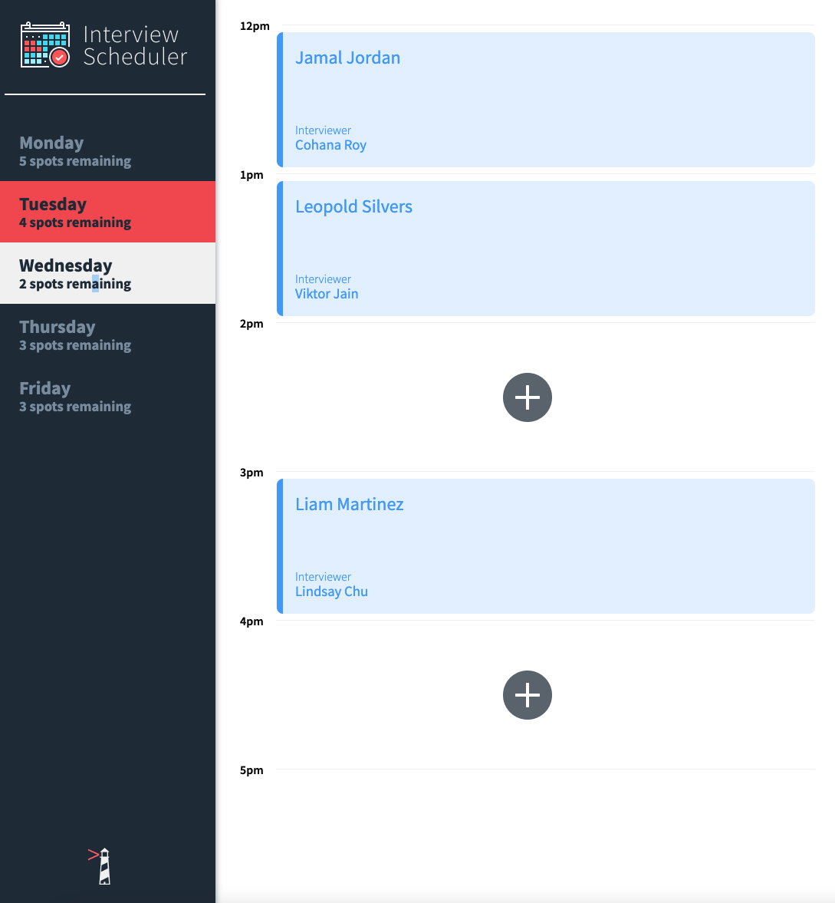
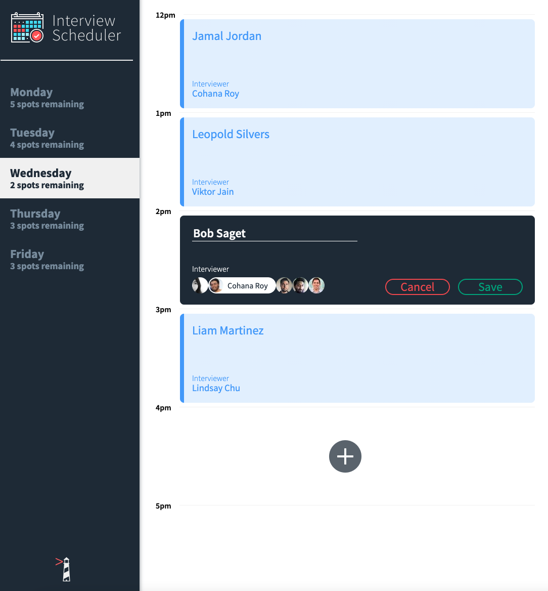
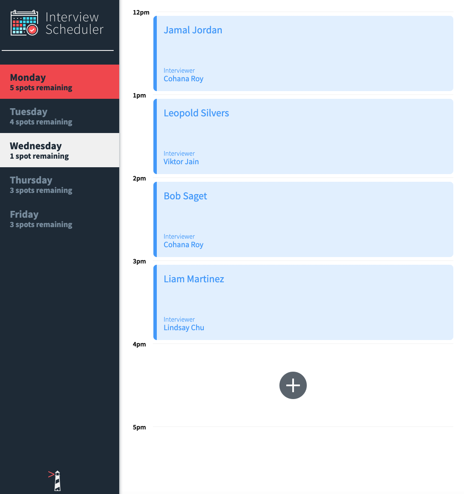

# 📅 Interview Scheduler

A modern, responsive single-page React application that allows students to book and manage interviews with mentors. Built with a focus on user experience, clean code architecture, and comprehensive testing.


## 🎯 Overview

The Interview Scheduler is a full-stack web application that demonstrates modern React development practices, component-based architecture, and real-time data management. Students can view available time slots, book interviews with their preferred mentors, and manage their appointments seamlessly.

## ✨ Key Features

### 🎨 User Interface
- **Modern Dark Theme**: Professional appointment creation form with dark styling
- **Responsive Design**: Optimized for desktop and mobile devices  
- **Real-time Updates**: Immediate visual feedback for all user actions
- **Accessible Design**: Proper color contrast and keyboard navigation support

### 📋 Core Functionality
- **Book Interviews**: Select time slots and preferred interviewers
- **Edit Appointments**: Modify existing interviews with validation
- **Delete Appointments**: Remove interviews with confirmation
- **Form Validation**: Comprehensive client-side validation for all inputs
- **Dynamic Updates**: Real-time appointment availability updates

### 🎯 Technical Highlights
- **Component Architecture**: Reusable, modular React components
- **State Management**: React Hooks for efficient state handling
- **Custom Hooks**: Abstracted business logic for data management
- **Error Handling**: Graceful error states and user feedback
- **Testing Coverage**: Unit, integration, and end-to-end testing

## 🏗️ Architecture

### Frontend Architecture
```
src/
├── components/           # Reusable UI components
│   ├── Application.js   # Main app component
│   ├── DayListItem.js   # Individual day display
│   ├── InterviewerList.js # Interviewer selection
│   └── Appointment/     # Appointment-related components
│       ├── index.js     # Main appointment component
│       ├── Form.js      # Appointment creation/editing
│       ├── Show.js      # Appointment display
│       ├── Empty.js     # Empty slot display
│       ├── Status.js    # Loading states
│       ├── Confirm.js   # Delete confirmation
│       └── Error.js     # Error handling
├── hooks/               # Custom React hooks
│   └── useApplicationData.js # Main data management
└── helpers/             # Utility functions
```

### Backend Architecture
```
server.js                # Express server with mock data
├── Mock Data Generation # Realistic appointment/interviewer data
├── RESTful API Endpoints # GET/PUT/DELETE operations
├── CORS Configuration   # Cross-origin request handling
└── Error Handling       # Proper HTTP status codes
```

## 🚀 Quick Start

### Prerequisites
- Node.js (v14 or higher)
- npm (v6 or higher)

### Installation & Setup

1. **Clone the repository**
   ```bash
   git clone https://github.com/yislamovic/scheduler.git
   cd scheduler
   ```

2. **Install dependencies**
   ```bash
   npm install
   ```

3. **Start the backend server**
   ```bash
   npm run start:server
   ```
   The backend API will be available at `http://localhost:8001`

4. **Start the development server** (in a new terminal)
   ```bash
   # For Node.js v16+
   NODE_OPTIONS=--openssl-legacy-provider npm start
   
   # For older Node.js versions
   npm start
   ```
   The application will open at `http://localhost:3000`

### Available Scripts

| Command | Description |
|---------|-------------|
| `npm start` | Starts the React development server |
| `npm run start:server` | Starts the Express backend server |
| `npm test` | Runs the Jest test suite |
| `npm run storybook` | Launches Storybook for component development |
| `npm run build` | Creates a production build |

## 🧪 Testing Strategy

### Testing Pyramid Implementation

**Unit Tests** - Component behavior and logic
```bash
npm test -- --coverage
```

**Integration Tests** - Component interaction and data flow
```bash
npm test -- --testPathPattern=integration
```

**End-to-End Tests** - Full user workflow testing
```bash
npm run cypress
```

**Component Testing** - Isolated component development
```bash
npm run storybook
```

## 🛠️ Technical Stack

### Frontend Technologies
- **React 16.9.0** - Component-based UI library
- **React Hooks** - Modern state management (useState, useEffect, useReducer)
- **Axios** - HTTP client for API communication
- **Classnames** - Dynamic CSS class management
- **CSS3** - Modern styling with custom properties and flexbox

### Backend Technologies  
- **Express.js 5.1.0** - Web application framework
- **CORS** - Cross-origin resource sharing
- **Body Parser** - Request body parsing middleware

### Development Tools
- **Create React App** - Zero-configuration React setup
- **Jest** - JavaScript testing framework
- **Storybook** - Component development environment
- **Cypress** - End-to-end testing framework
- **Sass** - CSS preprocessor for enhanced styling

## 🎨 UI/UX Design Philosophy

### Modern Interface Design
- **Dark Theme Forms**: Professional appointment creation with high contrast
- **Color Psychology**: Intuitive color coding (green for save, red for cancel/delete)
- **Visual Hierarchy**: Clear information architecture with proper spacing
- **Responsive Layout**: Flexible design adapting to different screen sizes

### User Experience Focus
- **Immediate Feedback**: Real-time validation and status updates
- **Error Prevention**: Form validation preventing invalid submissions
- **Consistent Interactions**: Uniform behavior across all components
- **Accessibility**: Keyboard navigation and screen reader support

## 📊 Component Breakdown

### Core Components

**Application** - Main app container managing global state
- Orchestrates data flow between components
- Handles routing and main application logic

**DayList & DayListItem** - Weekly schedule navigation
- Interactive day selection with appointment counts
- Visual indicators for current day and availability

**InterviewerList & InterviewerListItem** - Mentor selection interface  
- Circular profile images with selection highlighting
- Dynamic interviewer name display

**Appointment Components** - Modular appointment management
- **Empty**: Available time slot display with booking trigger
- **Form**: Interview creation/editing with validation
- **Show**: Booked appointment display with edit/delete options
- **Status**: Loading states during API operations
- **Confirm**: Delete confirmation modal
- **Error**: Graceful error handling and recovery

## 🔧 Advanced Features

### Custom Hooks Implementation
- **useApplicationData**: Centralized state management for appointments, days, and interviewers
- **Data Normalization**: Efficient data structure for quick lookups and updates
- **Optimistic Updates**: Immediate UI updates with rollback on errors

### Form Validation & Error Handling
- **Client-side Validation**: Real-time input validation
- **Error Recovery**: Graceful handling of network failures
- **User Feedback**: Clear error messages and loading indicators

### Performance Optimizations
- **Component Memoization**: Preventing unnecessary re-renders
- **Efficient State Updates**: Minimal state changes for maximum performance
- **CSS Custom Properties**: Consistent theming with minimal overhead

## 🚀 Deployment Considerations

### Production Build
```bash
npm run build
```
Creates optimized production files in the `build/` directory.

### Environment Variables
- Configure API endpoints for different environments
- Set up proxy configuration for development

### Performance Metrics
- Bundle size optimization
- Component render performance
- API response time monitoring

## 📈 Future Enhancements

- **Real-time Updates**: WebSocket integration for live appointment updates
- **Calendar Integration**: Google Calendar sync functionality  
- **Email Notifications**: Appointment reminders and confirmations
- **Advanced Filtering**: Search and filter appointments by criteria
- **Multi-timezone Support**: Global accessibility features
- **Mobile App**: React Native companion application

## 🤝 Contributing

1. Fork the repository
2. Create a feature branch (`git checkout -b feature/amazing-feature`)
3. Commit your changes (`git commit -m 'Add amazing feature'`)
4. Push to the branch (`git push origin feature/amazing-feature`)
5. Open a Pull Request

## 📄 License

This project is licensed under the MIT License - see the [LICENSE.md](LICENSE.md) file for details.

## 🙏 Acknowledgments

- Built as part of the Lighthouse Labs Web Development Bootcamp
- Inspired by modern scheduling applications and UX best practices
- Thanks to the React community for excellent documentation and resources

---

## 📸 Application Screenshots

### Main Interface

*Weekly schedule view with available time slots and booked appointments*

### Creating an Appointment  

*Dark-themed appointment form with interviewer selection and validation*

### Final Result

*Successfully created appointment with interviewer details*

---

**Built with ❤️ and React**